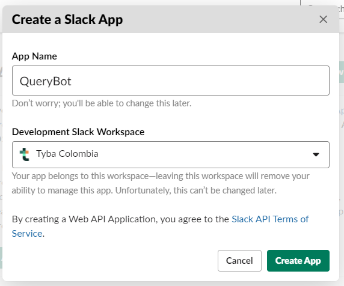
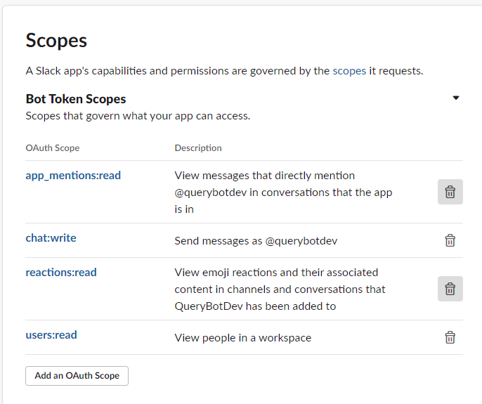
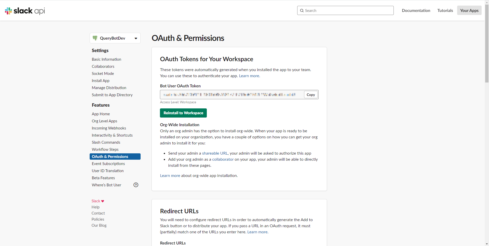
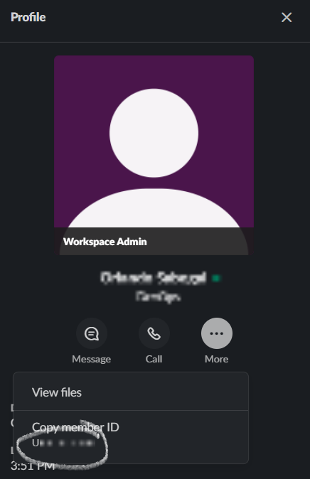
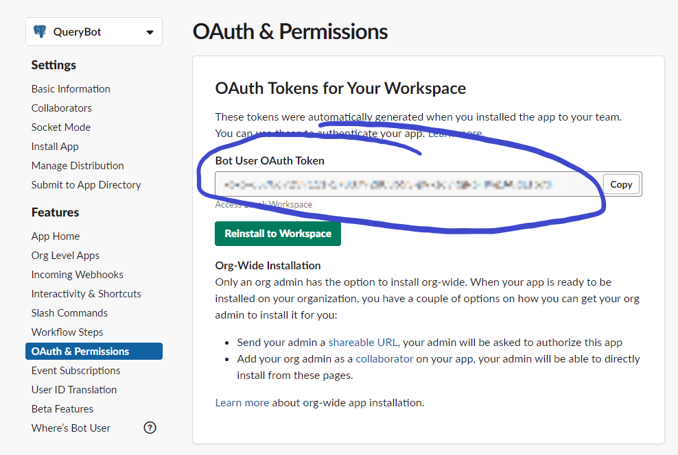
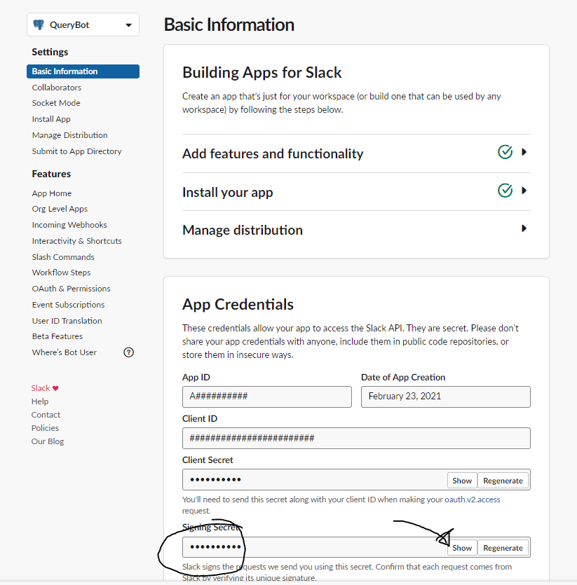
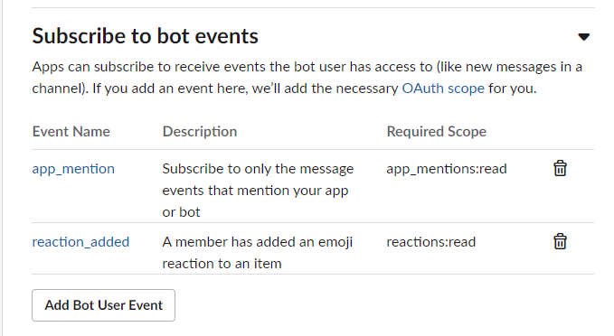

# Dumbobot

Hello there! Welcome to Dumbobot, an open source project that integrates Slack to help execute queries easier in your work environment. In this repository you will find the code we use to deploy the client in a lambda function as well as the configuration required with the Serverless framework. In this project, the bot's purpose is to read messages from users, process them to find an SQL query and wait for emoji's confirmation from authorized users to execute it in a desired environment.

## Set up the Slack app

A Slack app is an integrated program that is able to perform certain tasks in your own workspace. 
1. Go to https://api.slack.com/apps?new_app=1 and set your bot name and select your workspace (or sign in with a new one).

2. In the app configuration page, go to the **OAuth & Permissions** section, and in the **Bot Token Scopes** add the following scopes: *app_mentions:read*, *chat:write*, *reactions:read* and *users:read*. These are the main permissions that your app must have for this project to work propertly. When done, press the **Reinstall to Workspace** button to apply changes in the workspace.

3. Finally (For now at least), create a channel in which you want your queries to be received. In our case, we defined two for development and production queries.

## Set up the lambda function

**NOTE**: This project is adjusted to work with AWS lambda functions exclusively, but it doesn't mean it can't be done in a regular backend service of your preference, it must have a public IP to reach and the defined POST and GET HTTP endpoints.

1. Change the configuration in **resources/config/custom.yml** according to your AWS account setup. Also, fill the environment variables with your particular Slack information:

    - SLACK_CHANNEL: The ID of the channel in which you want to allow your queries. To find yours you have to right click on the channel and select **Copy Link**, this will be in your clipboard: https://{your-domain}.slack.com/archives/{channel-id}. Just take the channel-id value and you got it!

    

    - BOT_ID: In Slack, even bots or apps are considered users inside channels to adjust behaviours like tagging them in conversations (method we use here to detect queries), listening to reactions, and so on. To get this value you have to go to the **Apps** section, check for your bot's name, then click on the *Information* button at the top right and then click the *three dots more* option, it will show you that bot's ID.

    

    - DYNAMO_TABLE: We store logs of every query executed in a dynamo table. You can use this variable to place your own's table name and store your logs as well.

    - AUTHORIZED_USERS, AUTHORIZED_NUMBER and AUTHORIZED_DELETE: Are the amount of reactions to authorize a query execution, and the users that are allowed to react in order to authorize them. the authorized users must be a comma separated list of Slack IDs representing each authorized user. In order to find an user's ID, just go to it's profile and click on the *three dots more* option, it will show you that user's ID.

    

    - DUMBO_SECRET: Later in this README we will show you how to setup events in order to the bot to detect user activity. For this you need to setup a couple of credentials from the Slack App configuration page from last section, and we store them in an AWS Secrets Manager object stored in this variable, you can set yours here as well.

    - AUTH_REACTION: This is the ID of the emoji we defined for reactions count in order to authorize a query execution. We used the :100: emoji with ID '100', but you can define whichever of your preference.

2. You have to configure two important credentials to authenticate with the Slack API and validate that it's response is actually from Slack! For this, we created a Secrets Manager object (The DUMBO_SECRET from 1st step) and called them from here, but you can use the credentials manager of your choice. The credentials you need are **OAuth Token** and **Signing Secret**, found as shown in the following screenshots:

Store those values in a Secrets Manager object with keys **TOKEN** and **SECRET** respectively and remember to update the **DUMBO_SECRET** variable with it's name and thats it! In case you use another credentials manager, make sure you pass those values securely in the variables below the line 30's *TODO* in the script lambda_function.py.
 
# Deploy your Lambda Function and events

You should now be able to deploy your lambda function (Without entirely working tho!) using the serverless plugin and **npx**. For more information, check the official Serverless guide [here](https://www.serverless.com/framework/docs/providers/aws/cli-reference/deploy/). When you confirm that your function is succesfully deployed, go into the console and look for the URL of your function in API Gateway.

Now, go back to the Slack App configuration page and into the **Events Subscription** section, and then paste your function's URL in the verification field. It should say that your URL was verified, which means that your function is communicating correctly and now you can start setting your events. For this, open the *Subscribe to bot events* dropdown and add the *app_mention* and *reaction_added* scopes.

