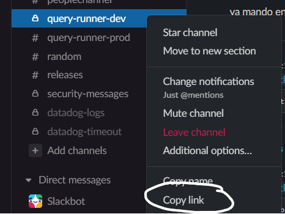
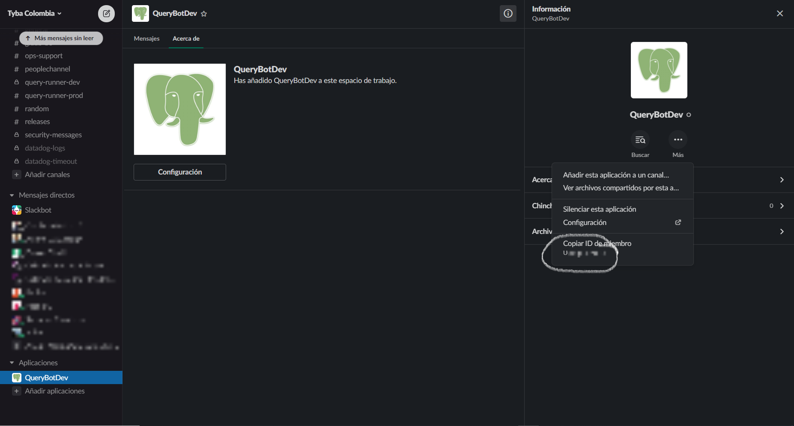

# Dumbobot

Hello there! Welcome to Dumbobot, an open source project that integrates Slack to help execute queries easier in your work environment. In this repository you will find the code we use to deploy the client in a lambda function as well as the configuration required with the Serverless framework. In this project, the bot's purpose is to read messages from users, process them to find an SQL query and wait for emoji's confirmation from authorized users to execute it in a desired environment.

## Set up the Slack app

A Slack app is an integrated program that is able to perform certain tasks in your own workspace. 
1. Go to https://api.slack.com/apps?new_app=1 and set your bot name and select your workspace (or sign in with a new one).
2. In the app configuration page, go to the **OAuth & Permissions** section, and in the **Bot Token Scopes** add the following scopes: *app_mentions:read*, *chat:write*, *reactions:read* and *users:read*. These are the main permissions that your app must have for this project to work propertly. When done, press the **Reinstall to Workspace** button to apply changes in the workspace.
3. Finally (For now at least), create a channel in which you want your queries to be received. In our case, we defined two for development and production queries.

## Set up the lambda function

**NOTE**: This project is adjusted to work with AWS lambda functions exclusively, but it doesn't mean it can't be done in a regular backend service of your preference, it must have a public IP to reach and the defined POST and GET HTTP endpoints.

1. Change the configuration in **resources/config/custom.yml** according to your AWS account setup. Also, fill the environment variables with your particular Slack information:

- SLACK_CHANNEL: The ID of the channel in which you want to allow your queries. To find yours you have to right click on the channel and select **Copy Link**, this will be in your clipboard: https://{your-domain}.slack.com/archives/{channel-id}. Just take the channel-id value and you got it!

- BOT_ID: In Slack, even bots or apps are considered users inside channels to adjust behaviours like tagging them in conversations (method we use here to detect queries), listening to reactions, and so on. To get this value you have to go to the **Apps** section, check for your bot's name, then click on the *Information* button at the top right and then click the *three dots more* option, it will show you that bot's ID.

